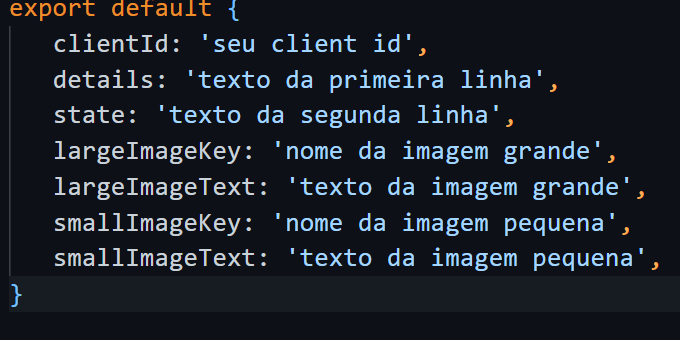

# DiscordRPC-Typescript

Um pequeno exemplo de como fazer uma Discord Rich Presence usando a linguagem typescript.


## Demonstração


## Requisitos

* Programa [Node.js](https://nodejs.org/) instalado.
* Algum editor de texto, recomendo Bloco de Notas, [Notepad++](https://notepad-plus-plus.org/downloads/v8.5.2/) ou [Visual Studio Code](https://code.visualstudio.com) (para pessoas experientes).
* Uma aplicação no [Discord Developers](https://discord.com/developers/applications). ([Ajuda](#como-criar-uma-aplicação))


## Tutorial de Instalação
Para usar este projeto você pode fazer um clone dele e seguir os seguintes passos:

> Para começar renomeie o arquivo config da pasta `src` removendo o `.example`. Seu arquivo deve ficar `config.ts`!

> Após esse passo basta entrar nele e colocar as informações como está descrito no mesmo. 

> 

> Quando fizer isso renomeie o arquivo `package.example.json` para `package.json`

> Por fim execute os comando abaixo em seu console.
```bash
mkdir dist
npm install
```


## Usando a RPC

Quando tiver tudo preparado basta usar o comando abaixo para iniciar a rich presence
```bash
npm start
```
E use esse comando para remover.
```bash
npm run end
```


## Contribuindo

Contribuições são sempre bem-vindas!

Para contribuir com esse projeto basta fazer um fork desse repositório, criar sua branch e modificar o que você quiser. Quando acabar faça um pull request e aguarde que eu irei analisar.


## Autor

- [uEriic](https://www.github.com/uEriic)


## Como criar uma aplicação

Para criar sua aplicação siga os passos desse [vídeo](https://youtu.be/oaOCt5ZuW5U).


## Licença

Este repositório é licenciado pela [MIT License](https://choosealicense.com/licenses/mit/), o que permite que você copie, modifique, reuse, etc.

